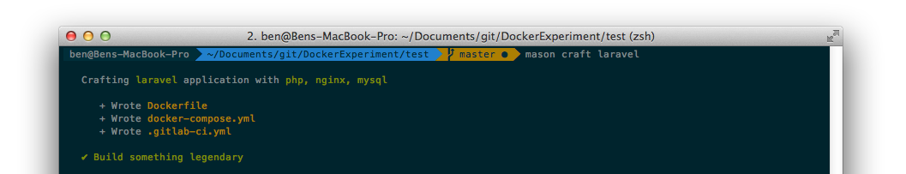

# Mason CLI

The Mason CLI makes getting started with Docker a breeze. 

We've carefully selected and specifically created Docker images that play together nicely so you can Dockerize your apps with a single command. It's like buildpacks for Docker.

Whether you're new to Docker or a pro, you'll love how it just works straight out of the box.

## Installation
Install the Mason CLI as a global NPM package like so:
```
npm install --global codemason
```

## Usage
Now you've installed Mason, you're ready to start building and deploying applications!

### The `craft` command



You can use the `craft` command to Dockerize your application.
```
$ mason craft laravel 
```
The generated files will be added to the current working directory.

Or if you want to get a little bit more specific you can specify exactly what containers you want to use
```
$ mason craft --with="php, mysql"
```


#### Supported Setups
We aim to support as many popular frameworks and architectures as possible.

##### Supported Pre-packed Application Environments
- Laravel

##### Supported Containers
- PHP
- MySQL

#### Example Flow 
- Create a new Laravel project  `laravel new pebble`
- Change into your new directory `cd pebble/` 
- Dockerize Laravel with `mason craft laravel`
- Spin up your environment `docker-compose up`

**That's all!** You're now running your Laravel application with Docker!


### The `create` command
The create command helps prepare your application for deployment through Codemason. It creates an applicaion on Codemason for you, prepares a `git remote` repository for code to be uploaded to and updates the `.gitlab-ci.yml` file so your app can be built correctly.

Default values will be provided for you but you can override them as required.

```
$ mason create

   Creating application on Codemason...

⁣     Application name (spoon-guide-1451)
⁣     Application path (/Users/ben/pebble)
⁣               Domain (spoon-guide-1451.mason.ci)

   ✔ Created application
   ✔ Created remote repository
   ✔ Added git remote codemason
```

### The `deploy` command
The deploy command takes the code you've checked in to `git` and uploads it to your Codemason `git remote`. It then builds your Docker image and gets pushed to the private registry. Codemason then spins it up on your server.

```
$ mason deploy

   Deploying application to Codemason...

      Uploading [====================] 100% 0.0s
       Building [====================] 100% 0.0s, ✔ passed
      Launching [====================] 100% 0.0s

     *´¨)
    ¸.•´ ¸.•*´¨) ¸.•*¨)
   (¸.•´ (¸.•` ¤ Application deployed and running at hello-world-1234.mason.ci
```

## Official Documentation 
Full documentation for the Mason CLI can be found on the [Codemason website](http://mason.ci/docs/mason-cli).


## License
The MIT License (MIT). Please see [License File](LICENSE.md) for more information.